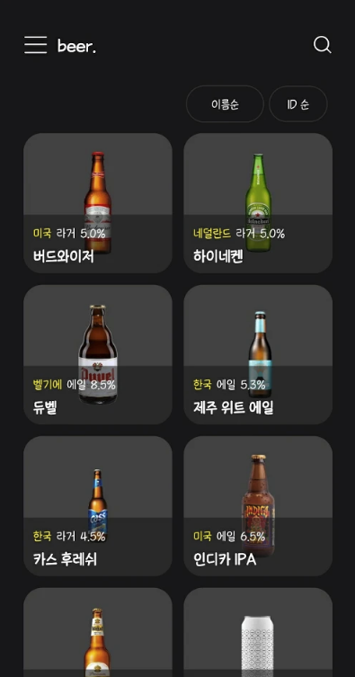
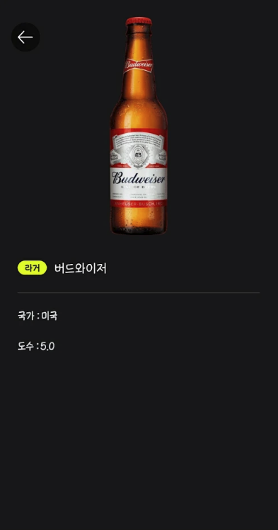

# Beer. - 비어닷 :beers:

> 오늘의 맥주는?

## Features :star2:

  

**세계 맥주 약 50종류에 대하여 정보를 얻을 수 있습니다!**

## Preview 📱

 

## Tech Stack :hammer_and_wrench:

**Architecture** 

- MVVM

**DataBase**

- Room

**Jetpack AAC**

- Data Binding
- ViewModel
- Lifecycles
- LiveData

**Server Side**

- Firebase

**Asynchronous Processing**

- Coroutine

## Contributors ✨

<table>
  <tr>
    <td align="center"><a href="https://github.com/KyuJeong"> <b>KyuJeong</b></a> <a href="https://github.com/landvibe-service/beereverything-android/commits?author=KyuJeong" title="Code">💻</a></td>
    <td align="center"><a href="https://github.com/gyurim"> <b>gyurim</b></a> <a href="https://github.com/landvibe-service/beereverything-android/commits?author=gyurim" title="Code">💻</a></td>
    <td align="center"><a href="https://jjjoonngg.github.io"> <b>Jong Sin Kim</b></a> <a href="https://github.com/landvibe-service/beereverything-android/commits?author=JJJoonngg" title="Code">💻</a></td>
    <td align="center"><a href="https://github.com/landvibelegend"> <b>landvibelegend</b></a> <a href="#projectManagement-landvibelegend" title="Project Management">📆</a></td>
  </tr>
</table>